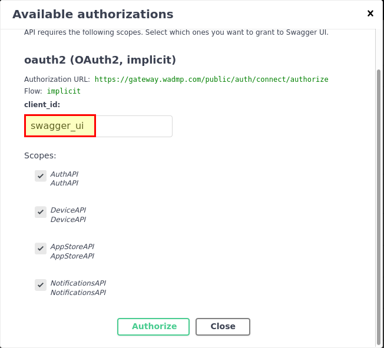

# WebAccess/DMP

_Description_: All notes or information on using WebAccess/DMP (WA/DMP).

## Login Information - API

* [WebAccess/DMP API](https://api.wadmp.com)

* Make sure you are logged into your account.

* Click on API Gallery.

* Select SWH API.

* Click on the Authorize button.

* 

* In the **client_id** field, please enter _swagger_ui_.

* Please be sure to check the box for the following fields: AuthAPI, DeviceAPI, AppStoreAPI and NotificationsAPI.

* Lastly, please click the Authorize button.

## Day 2

* [IoT Academy](https://academy.advantech.com/dashboard)
* Discussion with Martin
    - NAT
    - Transparent Mode
    - Video Tips/Tools

### WADMP Usti Tech Session 2022

#### Gen 2

* [UI](https://wadmp.com/)
* [Documentation](https://docs.wadmp.com/)
* [API](https://api.wadmp.com/)
* [WADMP Status](https://status.wadmp.com/)

